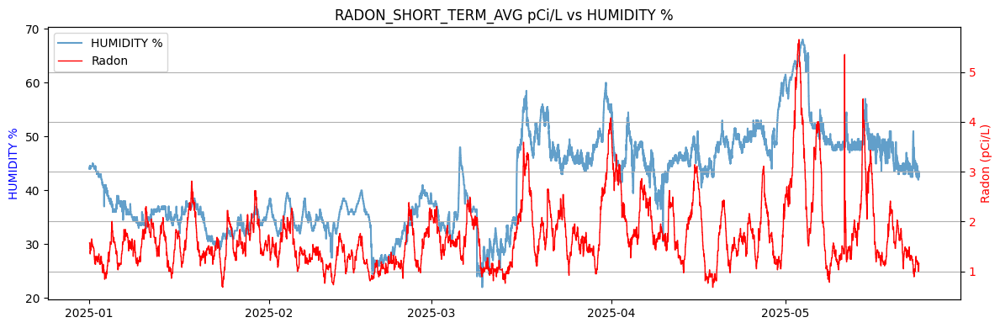
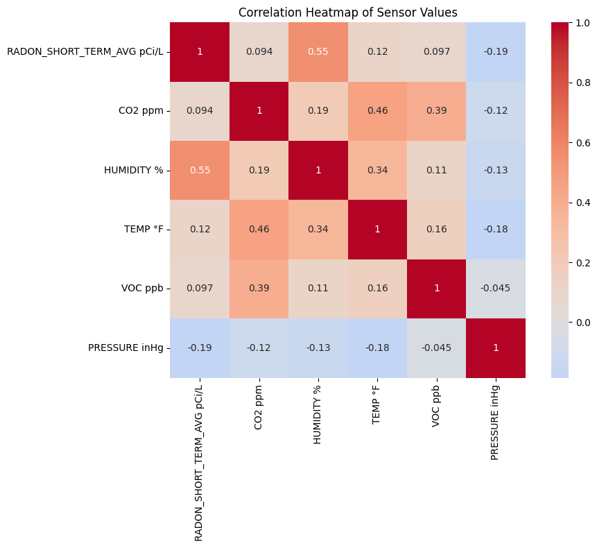
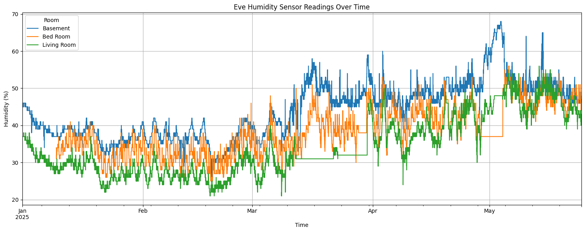

# Air Quality Analysis

This project analyzes indoor air quality data collected from a residential environment, focusing on metrics such as Radon levels, VOCs, humidity, temperature, and other relevant parameters. The goal is to understand the indoor air quality profile and identify patterns or anomalies over time.

## Overview

The analysis is conducted using Jupyter Notebooks, which process and visualize data from various sensors deployed within the home. The notebooks perform data cleaning, statistical analysis, and generate visualizations to interpret the air quality metrics effectively.

### Data Collection

Data was collected using a combination of air quality sensors installed throughout the home. The sensors recorded various parameters, including:

* Radon Levels: Measured in pCi/L to assess radioactive gas concentration.
* Volatile Organic Compounds (VOCs): Monitoring for harmful organic chemicals in the air.
* Humidity and Temperature: Tracking environmental comfort and potential mold growth conditions.
* Particulate Matter (PM2.5): Measuring fine inhalable particles with diameters of 2.5 micrometers and smaller.

The data was logged over an extended period to capture variations and trends.

### Analysis

The Jupyter Notebooks perform the following analyses:

* Data Cleaning: Handling missing values, correcting timestamps, and ensuring data consistency.
* Statistical Analysis: Calculating mean, median, quantiles, and identifying outliers in the data.
* Time Series Analysis: Examining trends and patterns over time for each air quality parameter.
* Correlation Analysis: Assessing relationships between different parameters, such as humidity vs. temperature.
* Visualization: Generating plots and charts to visualize data distributions and trends.

### Results

The analysis yielded several insights:

* Radon Levels: Several statistics and charts highlight changes to the radon levels over time.
* VOCs: Detected spikes in VOC levels correlating with specific activities or times of day.
* Humidity and Temperature: Observed fluctuations.
* PM2.5: Noted increased particulate matter during certain indoor activities.

#### Selection of Charts and tables

|       | radon short term avg pCi/L |
| ----- | -------------------------- |
| count | 3423                       |
| mean  | 1.710870581                |
| std   | 0.679612862                |
| min   | 0.68                       |
| 25%   | 1.24                       |
| 50%   | 1.57                       |
| 75%   | 1.97                       |
| max   | 5.65                       |

| Quantile | radon pCi/L |
| -------- | ----- |
| .99      | 4.1   |
| .95      | 3.05  |
| .90      | 2.54  |

These findings can inform decisions to enhance indoor air quality, such as adjusting ventilation, using air purifiers, or modifying household activities.

## Repository Contents

* AirQualityAnalysis.ipynb: Main notebook containing data processing and analysis.
* SensorReadings2025.csv: Dataset with recorded sensor readings.
* EveHumiditySensorData.csv: Additional dataset focusing on humidity measurements.

### Getting Started

To explore the analysis:

git clone https://github.com/DaveKT/AirQualityAnalysis.git  
cd AirQualityAnalysis  
jupyter notebook AirQualityAnalysis.ipynb  

Make sure you have the following Python packages installed:

* pandas
* matplotlib
* seaborn
